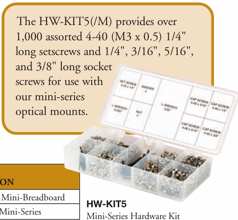
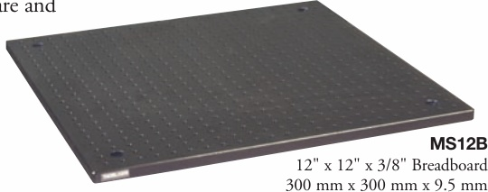

CHAPTERS 

Tables/

Breadboards Mechanics 

Optomechanic Devices 

Kits 

Lab Supplies 

## SECTIONS 

## Optical Breadboard Overview 

Thorlabs' honeycomb breadboards are made with the same advanced manufacturing and design methods used for our optical tabletops. We also offer solid aluminum breadboards, which provide a convenient and cost-effective platform for prototyping and optical experiments. Our imperial and metric breadboards range in size from $4\mathrm{~x~}6$ to 6'x 4' and 100 mm x 150 mm to 2000 mm x 1250 mm, respectively.

Available Options for Thorlabs' Honeycomb Breadboards 

<html><body><table border="1"><tbody><tr><td>OPTIONALFEATURES</td><td>ULTRALIGHTTMSERIES (Pages 4 - 5)</td><td>PERFORMANCETM SERIES (Pages 6 - 7)</td><td>PERFORMANCEPLUSTM SERIES (Pages 8 - 9)</td></tr><tr><td>Brushed Stainless Steel Top Plate</td><td>N/A</td><td>Standard</td><td>Standard</td></tr><tr><td>Black Finish on Top Plate</td><td>Standard</td><td>✔</td><td>✔</td></tr><tr><td>Brushed Steel Finish on Top Plate</td><td>N/A</td><td>✔</td><td>✔</td></tr><tr><td>Double-Density Hole Pattern</td><td>V</td><td>✔</td><td>✔</td></tr><tr><td>Blank Top Plate</td><td>✔</td><td>✔</td><td>✔</td></tr><tr><td>Access Wells for Standoff Posts</td><td>✔</td><td>✔</td><td>✔</td></tr><tr><td>Breadboard Levelers</td><td>✔</td><td>✔</td><td>✔</td></tr><tr><td>Nonmagnetic Top and Bottom Plates</td><td>Standard</td><td>✔</td><td>✔</td></tr><tr><td>Through Holes/Cutouts</td><td>✔</td><td>✔</td><td>✔</td></tr><tr><td>Custom Hole Patterns</td><td>✔</td><td>✔</td><td>✔</td></tr><tr><td>Aluminum Honeycomb Core</td><td>Standard</td><td>✔</td><td>✔</td></tr></tbody></table></body></html>

Feature Comparison of Honeycomb Breadboards 

<html><body><table border="1"><tbody><tr><td>OPTIONAL FEATURES</td><td>ULTRALIGHTTM SERIES (Pages 4 - 5)</td><td>PERFORMANCETM SERIES (Pages 6 - 7)</td><td>PERFORMANCEPLUSTMSERIES (Pages 8 - 9)</td></tr><tr><td>Thickness</td><td>1" or 2.2" (25 mm or 55 mm)</td><td>2.4" or 4.3" (60 mm or 110 mm)</td><td>2.4" or 4.3" (60 mm or 110 mm)</td></tr><tr><td>Flatness</td><td>±0.15 mm</td><td>±0.10 mm</td><td>±0.10 mm</td></tr><tr><td>Skin</td><td>Aluminum</td><td>Magnetic Stainless Steel</td><td>Magnetic Stainless Steel</td></tr><tr><td>Honeycomb Core</td><td>Aluminum</td><td>Plated Steel</td><td>Plated Steel</td></tr><tr><td>Sealed Holes</td><td>No</td><td>No</td><td>Yes</td></tr><tr><td>Weight per Unit Area</td><td>4.7 lb/ft2 or 6.0 lb/ft2 (24 kg/m2 or 30 kg/m2)</td><td>19 lb/ft2 or 23 lb/ft2 (98 kg/m2 or 114 kg/m2)</td><td>23 lb/ft2 or 28 lb/ft2 (114 kg/m2or 137 kg/m2)</td></tr></tbody></table></body></html>

<html><body><table border="1"><tbody><tr><td>ITEM #</td><td>METRIC ITEM #</td><td>$</td><td>子</td><td>€</td><td>RMB</td><td>DESCRIPTION</td></tr><tr><td>MS12B</td><td>MS12B/M</td><td>$ 257.00</td><td> 185.04</td><td>€223,59 € 80,21</td><td>￥ 2,048.29</td><td>12" x 12" High-Density Mini-Breadboard</td></tr><tr><td>HW-KIT5</td><td>HW-KIT5</td><td>HW-KIT5/M</td><td>$ 92.20</td><td>£ 66.38</td><td>￥ 734.83</td><td>Hardware Kit for Mini-Series</td></tr></tbody></table></body></html>

## Mini-Series Breadboard 

Our miniature breadboard features 4-40 (M3 x 0.5)tapped holes on 1/2" (12.5 mm) centers. These solidaluminum breadboards are complimented by a full range 

Mini-Breadboard and Hardware Kit 

accessories. These mounting components can be found on pages 74-86.

4-40 (M3 x 0.5)

Tapped Holes on 

1/2" (12.5 mm) Centers 