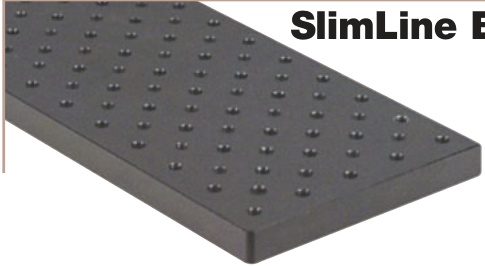

CHAPTERS 

Tables/Breadboards 

Mechanics 

Optomechanic 

Devices 

Kits 

### Breadboards - 1/2" (12.7 mm) Thick Solid Aluminum 

Custom Sizes and Shapes Available Upon Request 

Matte Black Anodized 

Metric Boards Manufactured and Stocked in Europe 

Flatness: ±0.006" (±0.15 mm) Over any 1 ft2 (0.3 m2) Area 

These solid aluminum breadboards provide a convenient platform for assembling 

prototype optical assemblies, conducting experiments, and mounting small 

subsystems. They have a black, low-reflective, anodized coating and feature 

1/4"-20 (M6 x 1.0) threads on 1" (25 mm) centers.

Solid Aluminum Construction!

The boards have a 1/2" (12.5 mm) border and four 1/4" (M6) counterbored clearance 

holes. The larger boards, which are denoted with double asterisks in the tables below, have a fifth 

counterbored clearance hole at the center of the board. The plates are machined from a 1/2" (12.7 mm) thick solid 

aluminum plate for superior flatness.

Because the holes are threaded completely through these breadboards, components can be mounted on both sides. Standoff posts (see 

pages 20 -22) alow the breadboards to be mounted above the surface of an optical tabletop (or breadboard) for access to components on 

both sides.

1/4"-20 Taps on 1" Centers, 1/2" Thick*

<html><body><table border="1"><tbody><tr><td>ITEM #</td><td>$</td><td>子</td><td>€</td><td>RMB</td><td>DESCRIPTION</td></tr><tr><td>MB4</td><td>$ 49.40</td><td>3 35.57</td><td>€ 42,98</td><td>￥ 393.72</td><td>4"x 6"</td></tr><tr><td>MB6</td><td>$ 55.10</td><td>子 39.67</td><td>3 47,94</td><td>￥ 439.15</td><td>6" x 6"</td></tr><tr><td>MB624</td><td>$ 186.00</td><td>£ 133.92</td><td>€161,82</td><td>￥1,482.42</td><td>6"x 24"</td></tr><tr><td>MB636</td><td>$ 246.00</td><td>7 177.12</td><td>€214,02</td><td>￥1,960.62</td><td>6"x 36"</td></tr><tr><td>MB648</td><td>$ 306.00</td><td>220.32</td><td>€266,22</td><td>￥2,438.82</td><td>6"x 48"</td></tr><tr><td>MB8</td><td>$ 82.00</td><td>7 59.04</td><td>€71,34</td><td>￥ 653.54</td><td>8"x 8"</td></tr><tr><td>MB810</td><td>$ 143.00</td><td>7 102.96</td><td>€124,41</td><td>￥1,139.71</td><td>8"x 10"</td></tr><tr><td>MB1012</td><td>$ 165.00</td><td>118.80</td><td>€143,55</td><td>￥1,315.05</td><td>10"x 12"</td></tr><tr><td>MB12</td><td>$ 161.10</td><td>£115.99</td><td>€140,16</td><td>￥1,283.97</td><td>12"x 12"</td></tr><tr><td>MB1218</td><td>$ 208.70</td><td> 150.26</td><td>€181,57</td><td>￥1,663.34</td><td>12" x 18"**</td></tr><tr><td>MB1224</td><td>$ 282.30</td><td>子 203.26</td><td>€245,60</td><td>￥2,249.93</td><td>12" x 24"**</td></tr><tr><td>MB1236</td><td>$ 505.00</td><td>子 363.60</td><td>€439,35</td><td>￥4,024.85</td><td>12" x 36"**</td></tr><tr><td>MB1248</td><td>$ 604.00</td><td>子 434.88</td><td>€525,48</td><td>￥4,813.88</td><td>12" x 48"**</td></tr><tr><td>MB18</td><td>$ 315.00</td><td>7 226.80</td><td>€274,05</td><td>￥2,510.55</td><td>18" x 18"**</td></tr><tr><td>MB1824</td><td>$ 420.00</td><td>子 302.40</td><td>€365,40</td><td>￥3,347.40</td><td>18" x 24"**</td></tr><tr><td>MB1836</td><td>$ 598.00</td><td>7 430.56</td><td>€ 520,26</td><td>￥ 4,766.06</td><td>18" x 36"**</td></tr><tr><td>MB2424</td><td>$ 537.00</td><td>子 386.64</td><td>€467,19</td><td>￥4,279.89</td><td>24" x 24"**</td></tr><tr><td>MB2436</td><td>$ 690.00</td><td>7 496.80</td><td>€ 600,30</td><td>￥5,499.30</td><td>24" × 36"**</td></tr><tr><td>MB2448</td><td>$ 913.00</td><td> 657.36</td><td>€794,31</td><td>￥7,276.61</td><td>24"x 48"**</td></tr></tbody></table></body></html>

## Stockedfor ImmediateShipment 

*Thickness may vary by ±0.005"

**These boards have a fifth mounting hole in the center 

M6 x 1.0 Taps on 25.0 mm Centers. 12.7 mm Thick*

<html><body><table border="1"><tbody><tr><td>ITEM #</td><td>$</td><td>子</td><td>€</td><td>RMB</td><td>DESCRIPTION</td></tr><tr><td>MB1015/M</td><td>$ 49.40</td><td>|£35.57</td><td>€ 42,98</td><td>￥ 393.72</td><td>100 mm x 150 mm</td></tr><tr><td>MB1515/M</td><td>55.10</td><td>£39.67</td><td>m 47.94</td><td>￥ 439.15</td><td>150 mmx 150 mm</td></tr><tr><td>MB1560/M</td><td>$186.00</td><td>£133.92</td><td>€161,82</td><td>￥ 1,482.42</td><td>150 mm x 600 mm</td></tr><tr><td>MB1590/M</td><td>$246.00</td><td>£177.12</td><td>€214.02</td><td>￥ 1,960.62</td><td>150 mm x 900 mm</td></tr><tr><td>MB15120/M</td><td>$306.00</td><td>£220.32</td><td>€266,22</td><td>￥ 2,438.82</td><td>150 mm x 1200 mm</td></tr><tr><td>MB2020/M</td><td>$ 82.00</td><td>子 59.04</td><td>€ 71,34</td><td>￥ 653.54</td><td>200 mm x 200 mm</td></tr><tr><td>MB2025/M</td><td>$143.00</td><td>£102.96</td><td>€124,41</td><td>￥ 1,139.71</td><td>200 mm x 250 mm</td></tr><tr><td>MB2530/M</td><td>$165.00</td><td>£118.80</td><td>€143,55</td><td>￥ 1,315.05</td><td>250 mmx 300 mm</td></tr><tr><td>MB3030/M</td><td>$161.10</td><td>£115.99</td><td>€140,16</td><td>￥ 1,283.97</td><td>300 mm x 300 mm</td></tr><tr><td>MB3045/M</td><td>$208.70</td><td>£150.26</td><td>€181.57</td><td>￥ 1,663.34</td><td>300 mm x 450 mm</td></tr><tr><td>MB3060/M</td><td>$282.30</td><td>£203.26</td><td>€245,60</td><td>￥ 2,249.93</td><td>300 mm x 600 mm**</td></tr><tr><td>MB3090/M</td><td>$505.00</td><td>£363.60</td><td>€439,35</td><td>￥ 4,024.85</td><td>300 mm x 900 mm**</td></tr><tr><td>MB30120/M</td><td>$604.00</td><td>£434.88</td><td>€525,48</td><td>￥ 4,813.88</td><td>300 mm x 1200 mm*</td></tr><tr><td>MB4545/M</td><td>$315.00</td><td>£226.80</td><td>€274,05</td><td>￥ 2,510.55</td><td>450 mmx 450 mm**</td></tr><tr><td>MB4560/M</td><td>$420.00</td><td>£302.40</td><td>€365,40</td><td>￥ 3,347.40</td><td>450 mm x 600 mm**</td></tr><tr><td>MB4590/M</td><td>$598.00</td><td>£430.56</td><td>€520,26</td><td>￥ 4,766.06</td><td>450 mm x 900 mm**</td></tr><tr><td>MB6060/M</td><td>$537.00</td><td>£386.64</td><td>€467,19</td><td>￥ 4,279.89</td><td>600 mm x 600 mm**</td></tr><tr><td>MB6090/M</td><td>$690.00</td><td>£496.80</td><td>€600,30</td><td>￥ 5,499.30</td><td>600 mm x 900 mm</td></tr><tr><td>MB60120/M</td><td>$913.00</td><td>£657.36</td><td>€794,31</td><td>天 7,276.61</td><td>600 mm x 1200 mm*</td></tr></tbody></table></body></html>

*Thickness may vary by ±0.1 mm 

**These boards have a fifch mounting hole in the center 

Lab Supplies 

SECTIONS 

Breadboards 

Breadboard Supports Breadboard Accessories ScienceDesk 

ScienceDesk Accessories Optical Tables 

Table Supports 

Optical Table Accessories 

## SlimLine Breadboards - Double-Density Hole Pattern 

The SlimLine series of breadboards provide a double-density 0.5" (12.5 mm)offset hole pattern. This configuration maximizes mounting versatility by doubling the number of tapped holes on the mounting surface. These boards are constructed from a 1/2" (12.7 mm) thick aluminum plate to maintain flatness over the full length. The slim profile allows these boards to fit into small spaces.

Double-Density Hole Pattern 

## Shipped from Stock in the US and Europe 

1/4"-20 Taps, 1/2" Offset Hole Pattern, 1/2" Thick*

<html><body><table border="1"><tbody><tr><td>ITEM #</td><td>$</td><td>子</td><td>€</td><td>RMB</td><td>DESCRIPTION</td></tr><tr><td>MB424</td><td>$ 161.00</td><td>115.92</td><td>€ 140,07</td><td>天 1,283.17</td><td>4"x 24"</td></tr><tr><td>MB436</td><td>$ 181.00</td><td>130.32</td><td>€ 157,47</td><td>￥ 1,442.57</td><td>4"x 36"</td></tr><tr><td>MB612</td><td>$ 124.00</td><td>子 89.28</td><td>€ 107,88</td><td>￥ 988.28</td><td>6" x 12"</td></tr><tr><td>MB824</td><td>$ 239.00</td><td>172.08</td><td>€ 207,93</td><td>￥ 1,904.83</td><td>8"x 24"</td></tr><tr><td>MB836</td><td>$ 322.00</td><td>£231.84</td><td>€ 280,14</td><td>￥ 2,566.34</td><td>8" x 36"</td></tr></tbody></table></body></html>

Custom Sizes Available Upon Request 

Matte Black Anodized Solid Aluminum Construction 

Metric Boards Manufactured and Stocked in Europe 

M6 x 1.0 Taps, 12.5 mm Offset Hole Pattern, 12.7 mm Thick*

<html><body><table border="1"><tbody><tr><td>ITEM #</td><td>$</td><td>子</td><td>3</td><td>RMB</td><td>DESCRIPTION</td></tr><tr><td>MB1060/M</td><td>$ 161.00</td><td></td><td></td><td>￥ 1,283.17</td><td>100 mm x 600 mm</td></tr><tr><td>MB1090/M</td><td>S 181.00</td><td>£130.32</td><td>€157,47</td><td>￥ 1,442.57</td><td>100 mm x 900 mm</td></tr><tr><td>MB1530/M</td><td>$ 124.00</td><td>子 89.28</td><td>€ 107,88</td><td>￥ 988.28</td><td>150 mm x 300 mm</td></tr><tr><td>MB2060/M</td><td>$ 239.00</td><td>172.08</td><td>€ 207,93</td><td>天 1,904.83</td><td>200 mm x 600 mm</td></tr><tr><td>MB2090/M</td><td>$ 322.00</td><td>£231.84</td><td>D 280,14</td><td>天 2,566.34</td><td>200 mm x 900 mm</td></tr></tbody></table></body></html>

*Thickness may vary by ±0.005"

*Thickness may vary by ±0.1 mm 