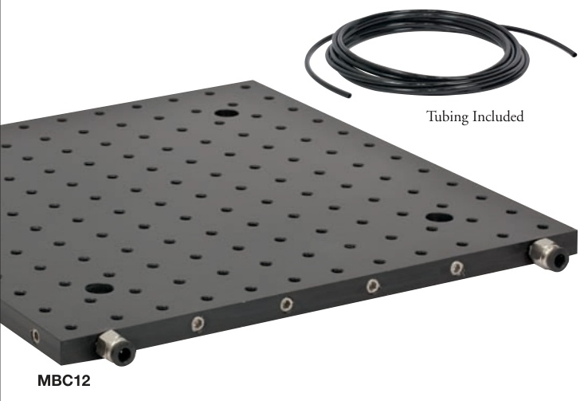
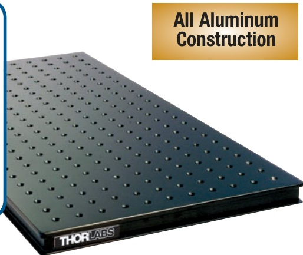

## CHAPTERS 

Tables/

Breadboards Mechanics 

Optomechanic Devices 

Kits 

Lab Supplies 

SECTIONS 

Breadboards 

Breadboard Supports Breadboard Accessories ScienceDesk 

ScienceDesk Accessories 

Optical Tables 

Table Supports 

Optical Table Accessories 

## Water-Cooled Breadboard 

Working Pressure: Rated up to 80 psi 

Working Temperature Range: 0 to 60 C 

Size: 12" x 12" (300 mm x 300 mm)

16' (5 m) of Tubing Included 

Push-to-Fit Tubing Connectors 

These breadboards with internal channels for cooling/heating fluid feature a standard 1.0" or 25 mm hole pattern and are ideal for applications involving sensors, detectors, lasers, LEDs, or other devices that may require temperature stabilization. The boards can be used for cooling or heating, depending on requirements.Our water-cooled breadboards are fitted with 1/4" or 6 mm I.D. fittings for imperial and metric boards,respectively. These allow for easy connection to a water supply or chiller unit.

Water-Cooled Breadboard 

<html><body><table border="1"><tbody><tr><td>ITEM #</td><td>METRIC ITEM #</td><td>$</td><td>子</td><td>€</td><td>RMB</td><td>DESCRIPTION</td></tr><tr><td>MBC12</td><td>MBC3030/M</td><td>$ 399.00</td><td>子 287.28</td><td>€ 347,13</td><td>￥ 3,180.03</td><td>Water-Cooled Breadboard</td></tr></tbody></table></body></html>

## UltraLight Series of Optical Breadboards (Page 1 of 2)

Specifications 

Mounting Hole Spacing • Imperial: 1/4"-20 on 1" Centers • Metric: M6 on 25 mm Centers Flatness: ±0.006" (±0.15 mm)Over any 1 ft2 (0.30 m2) Area Construction: Double-Plate,Single Honeycomb-Core,Athermalized Design 

Nonmagnetic UltraLightT optical breadboards, which offer a high strength-to-weight ratio and excellent thermal stability, are ideal for optical setups where portability and dynamic rigidity are important. They are typically used as lightweight alternatives to 

Outer Plates: Top 1/4" (6 mm)Thick, Bottom 1/8" (3 mm) Thick Edge of Top Plate to First Hole • Imperial: 1"

• Metric: 25 mm 

Maximum Screw Depth: 5/8"(16 mm) from Breadboard Surface 

steel breadboards as well as for applications demanding a totally nonmagnetic structure. The options listed here are stocked for immediate shipment. Please visit our website (www.thorlabs.com)to view other size options.

Imperial UltraLight Breadboards, 1" Thick 

<html><body><table border="1"><tbody><tr><td></td><td colspan="2"></td><td colspan="2"></td><td colspan="2"></td><td colspan="2"></td><td></td></tr><tr><td>ITEM #</td><td>$</td><td>子</td><td>€</td><td>RMB</td><td>DIMENSIONS</td><td>WEIGHT*</td><td></td><td></td><td></td></tr><tr><td>PBG11102</td><td>$</td><td>511.90</td><td>子 子</td><td>368.57</td><td>€</td><td>445,35</td><td>￥ 4,079.84</td><td>2^'x1'x1"$</td><td>11 lbs/5 kg</td></tr><tr><td>PBG11105</td><td>$</td><td>725.60</td><td>子</td><td>522.43</td><td>€</td><td>631,27</td><td>￥ 5,783.03</td><td>2'x 2'x1"</td><td>20 lbs/9 kg</td></tr><tr><td>PBG11103</td><td>$</td><td>617.60</td><td>子</td><td>444.67</td><td>3</td><td>537,31</td><td>￥ 4,922.27</td><td>3^'x1'x1"</td><td>20 lbs/9 kg</td></tr><tr><td>PBG11106</td><td>$</td><td>936.20</td><td>子</td><td>674.06</td><td>3</td><td>814,49</td><td>￥ 7,461.51</td><td>3'x 2'x1"</td><td>29 lbs/13 kg</td></tr><tr><td></td><td></td><td></td><td></td><td></td><td></td><td></td><td></td><td></td><td></td></tr><tr><td>PBG11110</td><td>$</td><td>1,095.60</td><td>子</td><td>788.83</td><td>€</td><td>953,17</td><td>￥</td><td>￥ 8,731.93</td><td>3'x 2.5'x 1"</td></tr><tr><td>PBG11112</td><td>$</td><td>1,255.60</td><td>子</td><td>904.03</td><td>€</td><td>1.092,37</td><td>￥</td><td>10,007.13</td><td>3^'x 3'x 1"</td></tr><tr><td>PBG11107</td><td>$</td><td>1,146.40</td><td>子</td><td>825.41</td><td>3</td><td>997,37</td><td>￥</td><td>9,136.81</td><td>4'x 2'x1"</td></tr><tr><td>PBG11111 PBG11113</td><td>$</td><td>1,357.50</td><td>子 子</td><td>977.40</td><td>3</td><td>1.181,03 1.365,64</td><td>￥</td><td>10,819.28</td><td>4'x 2.5'x 1" 4^'x 3'x1"</td></tr></tbody></table></body></html>

*The weightsgiveareforthebreadboardsaloneand donotinclude packaging 