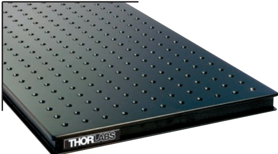
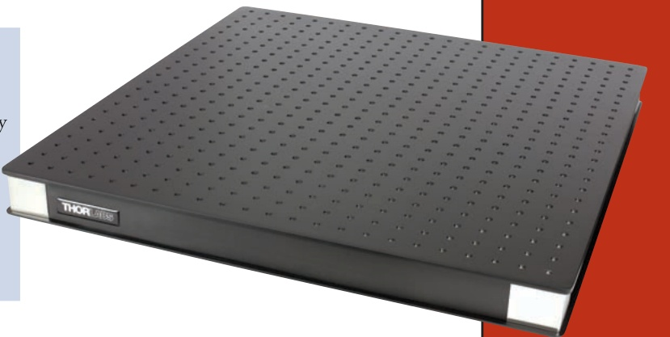

## UltraLight Series of Optical Breadboards (Page 2 of 2)

Sizes Shown Here are Stocked for Immediate Shipment.Other Sizes are Available up to 4' x 6' (1250 mm x 1800 mm)Lab Supplies 

Imperial UltraLight Breadboards, 2.2" Thick 

<html><body><table border="1"><tbody><tr><td>ITEM #</td><td>$</td><td>子</td><td></td><td>€</td><td>RMB</td><td>DIMENSIONS</td><td>WEIGHT*</td></tr><tr><td>PBG12118</td><td>$ 654.40</td><td>子</td><td>471.17 €</td><td>569,33</td><td>￥ 5,215.57</td><td>2'x1.5'x 2.2"</td><td>26 lbs/12 kg</td></tr><tr><td>PBG12105</td><td>$ 808.60</td><td>子 582.19</td><td>3</td><td>703,48</td><td>天 6,444.54</td><td>2' x 2'x 2.2"</td><td>27 lbs/12 kg</td></tr><tr><td>PBG12106</td><td>$ 1,021.00</td><td>子 735.12</td><td>€</td><td>888,27</td><td>天 8,137.37</td><td>3' x 2' x 2.2"</td><td>35 lbs/16 kg</td></tr><tr><td>PBG12110</td><td>$ 1,180.70</td><td>子 850.10</td><td>€</td><td>1.027,21</td><td>天 9,410.18</td><td>3' x 2.5' x 2.2"</td><td>44 lbs/20 kg</td></tr><tr><td>PBG12111</td><td>$ 1,443.90</td><td>子 1,039.61</td><td>€</td><td>1.256,19</td><td>天 11,507.88</td><td>4' x 2.5' x 2.2"</td><td>60 lbs/27 kg</td></tr><tr><td>PBG12113</td><td>$ 1,656.90</td><td>子 1,192.97</td><td>€</td><td>1.441,50</td><td>天 13,205.49</td><td>4' x 3'x 2.2"</td><td>71 lbs/32 kg</td></tr><tr><td>PBG12114</td><td>$ 1,973.50</td><td>£ 1,420.92</td><td>3</td><td>1.716,95</td><td>￥ 15,728.80</td><td>5' x 3' x 2.2"</td><td>86 lbs/39 kg</td></tr></tbody></table></body></html>

Metric UltraLight Breadboards, 25 mm Thick 

<html><body><table border="1"><tbody><tr><td>ITEM #</td><td>$</td><td>子</td><td>€</td><td>RMB</td><td>DIMENSIONS</td><td>WEIGHT*</td></tr><tr><td>PBG51501</td><td>$ 402.80</td><td>子 290.02</td><td>€ 350,44</td><td>￥ 3,210.32</td><td>300 mm x 300 mm x 25 mm</td><td>7 lbs/3 kg</td></tr><tr><td>PBG51502</td><td>$ 505.30</td><td>子 363.82</td><td>3 439,61</td><td>￥ 4,027.24</td><td>600 mm x 300 mm x 25 mm</td><td>11 lbs/5 kg</td></tr><tr><td>PBG51522</td><td>$ 609.20</td><td>子 438.62</td><td>€ 530,00</td><td>天 4,855.32</td><td>600 mm x 450 mm x 25 mm</td><td>18 lbs/8 kg</td></tr><tr><td>PBG51505</td><td>$ 713.10</td><td>子 513.43</td><td>€ 620,40</td><td>天 5,683.41</td><td>600 mm x 600 mm x 25 mm</td><td>23 lbs/10.5 kg</td></tr><tr><td>PBG51503</td><td>$ 607.80</td><td>437.62 子</td><td>€ 528,79</td><td>￥ 4,844.17</td><td>900 mm x 300 mm x 25 mm</td><td>31 lbs/14 kg</td></tr><tr><td>PBG51506</td><td>$ 917.10</td><td>子 660.31</td><td>€ 797,88</td><td>￥ 7,309.29</td><td>900 mm x 600 mm x 25 mm</td><td>33 lbs/15 kg</td></tr><tr><td>PBG51510</td><td>$ 1,071.80</td><td>子 771.70</td><td>€ 932,47</td><td>天 8,542.25</td><td>900 mm x 750 mm x 25 mm</td><td>40 lbs/18 kg</td></tr><tr><td>PBG51512</td><td>$ 1,226.40</td><td>子 883.01</td><td>€ 1.066,97</td><td>￥ 9,774.41</td><td>900 mm x 900 mm x 25 mm</td><td>51 lbs/23 kg</td></tr><tr><td>PBG51507</td><td>$ 1,121.10</td><td>子 807.19</td><td>€ 975,36</td><td>￥ 8,935.17</td><td>1200 mm x 600 mm x 25 mm</td><td>37 lbs/17 kg</td></tr><tr><td>PBG51511</td><td>$ 1,326.50</td><td>子 955.08</td><td>€ 1.154,06</td><td>天 10,572.21</td><td>1200 mm x 750 mm x 25 mm</td><td>57 lbs/26 kg</td></tr><tr><td>PBG51513 PBG51514</td><td>$ 1,531.90</td><td>7 1,102.97</td><td>€ 1.332,75</td><td>￥ 12,209.24</td><td>1200 mm x 900 mmx 25 mm</td><td>66 lbs/30 kg</td></tr><tr><td>$ 1,837.40</td><td>子 1,322.93</td><td>€</td><td>1.598,54</td><td>￥ 14,644.08</td><td>1500 mmx 900 mmx 25 mm</td><td>88 lbs/40 kg</td></tr></tbody></table></body></html>

*The weights given are for the breadboards alone and do not include packaging.

## Additional Size Options Available 

The imperial and metric UltraLight breadboards featured on these two pages are stocked for immediate shipment. However, Thorlabs also has the tooling and supplies necessary to manufacture numerous other sizes quickly and efficiently with minimal lead time. Please visit www.thorlabs.com to view our non-standard size options and to place an order. Finally, in addition to these stocked and non-stocked UltraLight breadboard options,Thorlabs can produce truly custom breadboards that offer unique cutouts,hole patterns, and dimensions. Please contact tech support to discuss your application needs.

CHAPTERS 

Tables/Breadboards 

Mechanics 

Optomechanic 

Devices 

Kits 

## SECTIONS 

*The weightsgivenarefor thebreadboardsaloneand do not include packaging 

Metric UltraLight Breadboards, 55 mm Thick 

<html><body><table border="1"><tbody><tr><td>ITEM #</td><td>$</td><td>子</td><td>€</td><td>RMB</td><td>DIMENSIONS</td><td>WEIGHT*</td><td></td><td></td></tr><tr><td>PBG52502</td><td>$ 540.30</td><td>子 389.02</td><td>€ 470,06</td><td>天 4,306.19</td><td>600 mm x 300 mm x 55 mm</td><td>13 lbs/6 kg</td><td></td><td></td></tr><tr><td>PBG52522</td><td>$ 644.90</td><td>子 464.33</td><td>€ 561,06</td><td>天 5,139.85</td><td>600 mm x 450 mm x 55 mm</td><td>18 lbs/8.2 kg</td><td></td><td></td></tr><tr><td>PBG52505</td><td>$ 780.50</td><td>子 561.96</td><td>€ 679,04</td><td>￥ 6,220.59</td><td>600 mm x 600 mm x 55 mm</td><td>24 lbs/11 kg</td><td>PBG52506</td><td>$ 1,001.40</td></tr><tr><td>PBG52510</td><td>$ 1,156.80</td><td>子 832.90</td><td>€ 1.006,42</td><td>天 9,219.70</td><td>900 mm x 750 mm x 55 mm</td><td>44 lbs/20 kg</td><td></td><td></td></tr><tr><td>PBG52511</td><td>$ 1,412.90</td><td>子 1,017.29</td><td>€ 1.229,22</td><td>￥ 11,260.81</td><td>1200 mm x 750 mm x 55 mm</td><td>55 lbs/25 kg</td><td></td><td></td></tr><tr><td>PBG52513</td><td>$</td><td>1,619.00</td><td>子 1,165.68</td><td>€ 1.408,53</td><td>￥ 12,903.43</td><td>1200 mm x 900 mm x 55 mm</td><td>57 lbs/27 kg</td><td></td></tr><tr><td>PBG52508</td><td>$</td><td>1,413.00</td><td>子</td><td>1,017.36</td><td>€</td><td>€ 1.229,31</td><td>￥ 11,261.61</td><td>1500 mm x 600 mm x 55 mm</td></tr><tr><td>PBG52514</td><td>$</td><td>1,925.90</td><td>子</td><td>1,386.65</td><td>€</td><td>€ 1.675,53</td><td>￥ 15,349.42</td><td>1500 mm x 900 mm x 55 mm</td></tr><tr><td>PBG52521</td><td>$ 3,182.10</td><td>子</td><td>2,291.11</td><td>€ 2.768,43</td><td>天 25,361.34</td><td>1800 mm x 1250 mm x 55 mm</td><td>145 lbs/66 kg</td><td></td></tr><tr><td></td><td></td><td></td><td></td><td></td><td></td><td></td><td></td><td></td></tr></tbody></table></body></html>

*The weights givenare for thebreadboardsaloneand do notinclude packaging.